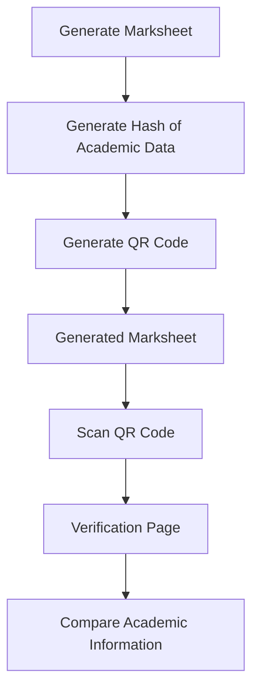
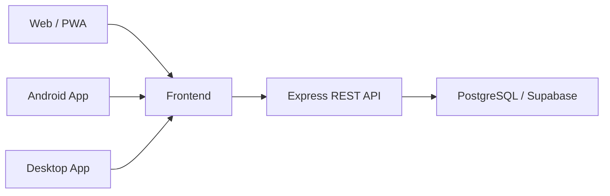

<p align="center">
  <h1 align="center">College Management System</h1>
</p>

<p align="center">
  <i>A web-based platform for managing students, faculty, courses, attendance, marks, and academic records.</i>
</p>

<p align="center">
  <a href="https://github.com/Pranayy1/college-management-system">
    
  </a>
  
  
  
  
  
</p>

<p align="center">
  <b>Live Demo: Coming Soon</b>
</p>

---

## Overview

**College Management System** is a web-based application designed to centralize and simplify common academic and administrative activities within a college.

The system provides role-based access for **Admin, Faculty, and Students**, allowing each role to access the functionality relevant to them. It includes modules for student and faculty management, courses and subjects, attendance, marks, reports, and marksheet generation and verification.

This project is being developed as an **individual B.Tech CSE major project during the 7th semester** at **Vindhya Institute of Technology and Science (V.I.T.S.), Satna**.

> **Project status:** The project is actively being developed and refined. Minor bugs and issues present in the existing implementation have been fixed as part of the current development work. Further customization and improvements are planned.

---

## Project Objectives

The primary objectives of the project are:

- Build a centralized platform for college academic management.
- Reduce dependency on manual records and spreadsheets.
- Provide separate workflows for Admin, Faculty, and Students.
- Simplify student, faculty, course, attendance, and marks management.
- Provide role-based access to protect academic information.
- Generate structured academic reports and marksheets.
- Provide a foundation that can be further customized according to institutional requirements.

---

## Features

### Admin Portal

| Feature | Description |
|---|---|
| Dashboard | View college-wide statistics and academic information |
| Student Management | Add, view, edit, and delete student records |
| Faculty Management | Manage faculty accounts and subject assignments |
| Import Students / Faculty | Bulk-create accounts using Excel templates |
| Import Marks | Upload marks using Excel-based templates |
| Course & Subject Management | Manage courses, semesters, years, and subjects |
| Assign Subjects | Assign subjects to faculty members |
| Attendance Management | View and manage attendance records |
| Marks Management | View and manage academic marks |
| Reports | Access attendance and marks analytics |
| Marksheet | Generate academic marksheets |
| Profile Management | Manage institution-related profile information |

### Faculty Portal

| Feature | Description |
|---|---|
| Dashboard | Overview of assigned academic information |
| Attendance | Take and edit attendance for assigned classes |
| Marks | Enter and manage marks for assigned subjects |
| Reports | View attendance and marks-related reports |
| Faculty Profile | View and update personal profile information |

### Student Portal

| Feature | Description |
|---|---|
| Dashboard | View personal academic information |
| Attendance Tracker | View subject-wise attendance and percentage |
| Marks | View internal, theory, practical, and total marks |
| Marksheet | Access academic marksheet information |
| Profile | Manage available personal account information |

---

## Role & Access

| Feature | Student | Faculty | Admin |
|---|:---:|:---:|:---:|
| View own attendance | ✅ | ✅ | ✅ |
| Take / edit attendance | ❌ | ✅ | ✅ |
| View own marks | ✅ | ✅ | ✅ |
| Enter / edit marks | ❌ | ✅ | ✅ |
| Import marks via Excel | ❌ | ❌ | ✅ |
| Print / generate marksheet | ✅ | ❌ | ✅ |
| Verify marksheet | ✅ | ✅ | ✅ |
| Manage students / faculty | ❌ | ❌ | ✅ |
| Import students / faculty | ❌ | ❌ | ✅ |
| Manage courses & subjects | ❌ | ❌ | ✅ |
| Manage institution profile | ❌ | ❌ | ✅ |

---

## Marksheet Verification

The project includes a marksheet generation and verification workflow.



The existing implementation uses a **SHA-256 hash** and QR-based verification mechanism to provide a way to verify generated marksheet information.

---

## Authentication & Security

The application includes several mechanisms for controlling access and protecting application data:

| Feature | Description |
|---|---|
| Email + Password | JWT-based authentication with bcrypt password hashing |
| Google OAuth | OAuth-based authentication support |
| Role-Based Access Control | Access is controlled according to user roles |
| Attendance Restriction | Faculty attendance operations are restricted according to the application's rules |
| SHA-256 Marksheet Verification | Academic data can be associated with a cryptographic hash |
| QR Verification | QR codes provide access to the marksheet verification workflow |
| Offline Detection | PWA-aware detection for connectivity/backend availability |
| Dark / Light Mode | User interface supports dark and light themes |

---

## System Architecture



The project is organized into three primary layers:

| Part | Responsibility |
|---|---|
| Frontend | React + Vite application and role-based dashboards |
| Backend | Express REST API, authentication, authorization, controllers and routes |
| Database | PostgreSQL database for application and academic data |

---

## Tech Stack

### Frontend
- React 19
- React Router
- Vite
- Tailwind CSS

### Backend
- Node.js
- Express.js

### Database
- PostgreSQL
- Supabase

### Authentication
- JWT
- bcrypt
- Google OAuth 2.0

### Cross-Platform
- Capacitor
- Electron

### Academic Documents
- QR Code generation
- Web Crypto API / SHA-256
- jsPDF
- html2canvas

### Excel
- SheetJS
- ExcelJS

---

## Screenshots

> Screenshots will be updated as the project UI is customized and finalized.

<details>
<summary>Click to expand</summary>

### Login

Add login screenshots here.

### Admin Dashboard

Add admin dashboard screenshots here.

### Faculty Dashboard

Add faculty dashboard screenshots here.

### Student Dashboard

Add student dashboard screenshots here.

</details>

---

## Running Locally

### 1. Clone the repository

```bash
git clone https://github.com/Pranayy1/college-management-system.git
cd college-management-system
```

### 2. Setup the backend

```bash
cd backend
npm install
```

Create the required `.env` file based on the environment variables used by the project.

Then start the backend:

```bash
npm run dev
```

### 3. Setup the frontend

Open another terminal:

```bash
cd frontend
npm install
```

Configure the required frontend environment variables and start the development server:

```bash
npm run dev
```

The frontend is typically available at:

```text
http://localhost:5173
```

> Environment variables and credentials should never be committed to the repository.

---

## Project Status

The project is currently under active development as a **B.Tech CSE 7th-semester major project**.

Current work includes:

- Fixing minor bugs and issues in the existing implementation.
- Reviewing existing functionality.
- Improving reliability and usability.
- Customizing the project according to academic requirements.
- Planning further feature and UI improvements.

A public live demo will be made available in the future with appropriate demonstration credentials.

---

## Limitations

- The current implementation is based on an existing college management system and is being progressively customized.
- Some academic workflows may require further configuration for different institutional structures.
- The application is still under development.
- Automated test coverage may need to be expanded.
- Some modules may be refined as project requirements evolve.

---

## Attribution & Project Basis

This project is an **academic adaptation and further development of an existing open-source College Management System**.

The original project that served as the starting point is:

**Original Repository:**  
https://github.com/AyusmanNanda/college-management-system

The current repository contains the ongoing work, bug fixes, customization, and further development carried out for the academic major project.

The original project's applicable license and attribution requirements are retained in this repository.

---

## Academic Information

| Field | Details |
|---|---|
| Project | College Management System |
| Project Type | B.Tech CSE Major Project |
| Semester | 7th Semester |
| Institution | Vindhya Institute of Technology and Science (V.I.T.S.), Satna |
| Developer | Pranay Pandey |
| Team | Individual Project |
| Academic Year | 2026–27 |

---

## Repository

**Current Repository:**  
https://github.com/Pranayy1/college-management-system

---

## License

This project retains the license applicable to the original project. See [`LICENSE`](./LICENSE) for the complete license text.

---

<p align="center">
  <i>Developed and customized as an individual B.Tech CSE major project.</i>
</p>
