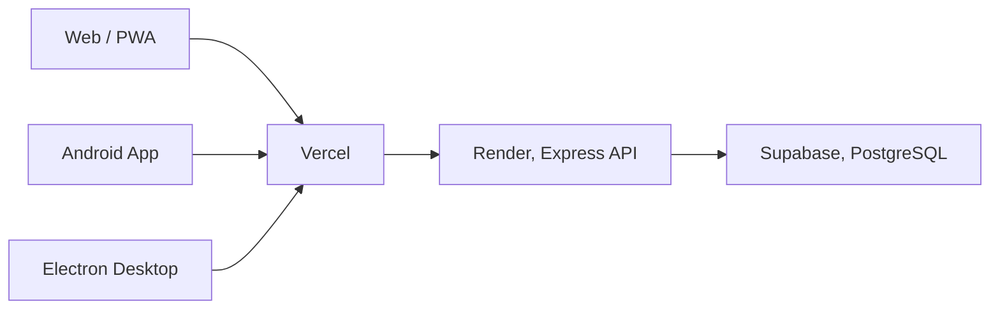
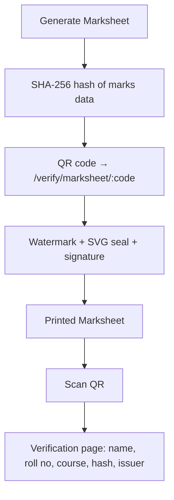
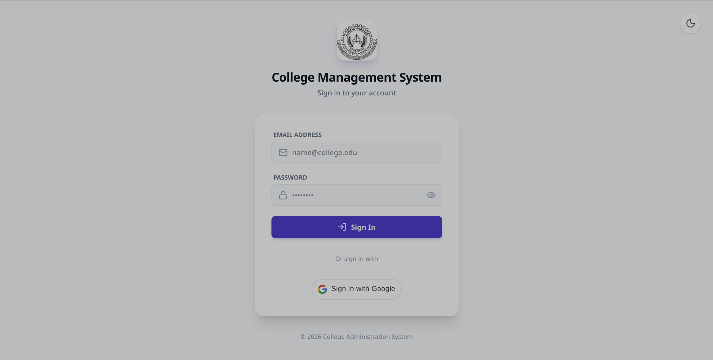
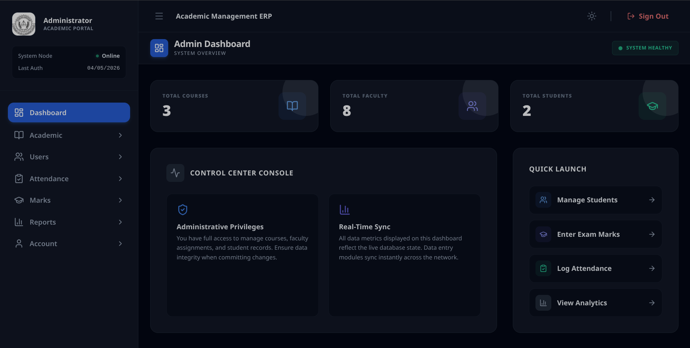
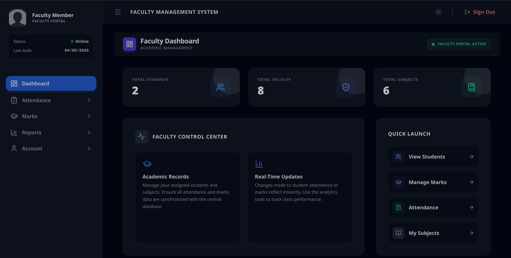
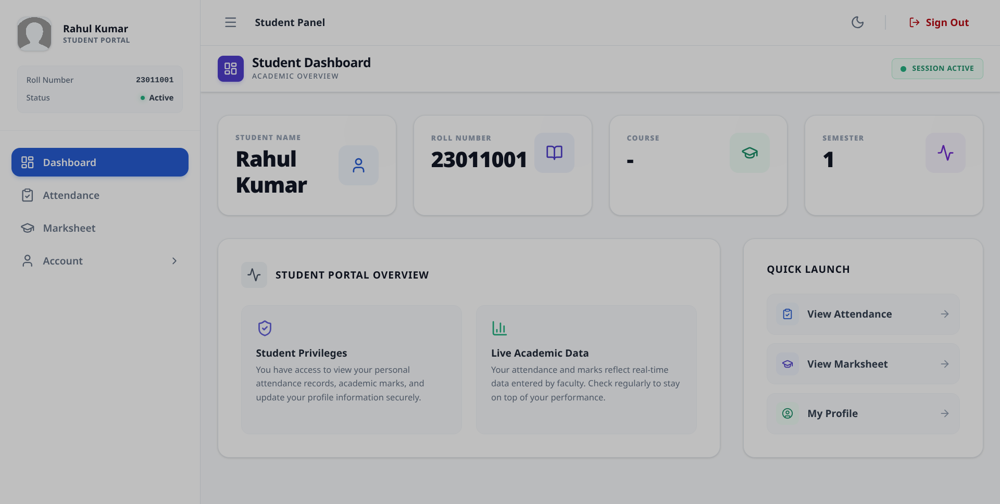
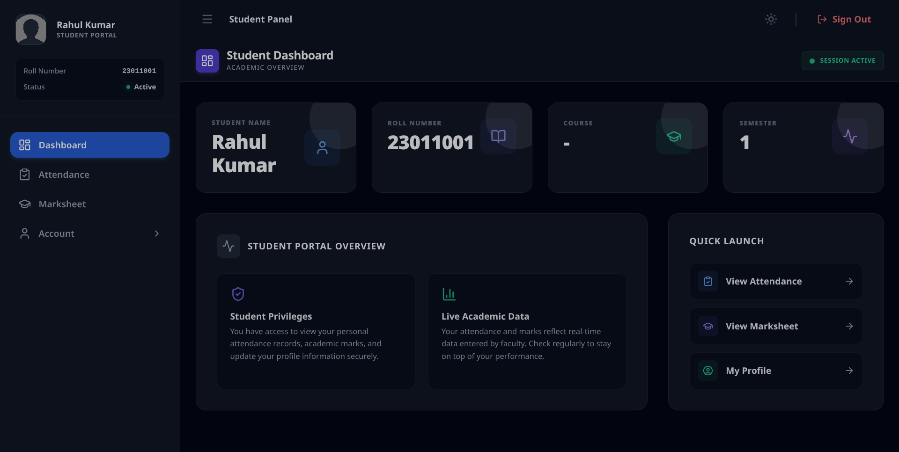

<p align="center">
  
</p>

<h1 align="center">Axiom</h1>
<p align="center"><i>College Management System</i></p>
<p align="center"><sub>The Government College of Engineering, Keonjhar name and logo/crest are trademarks of GCE Keonjhar, used here for attribution only, not covered by this project's license, see <a href="./LICENSE">LICENSE</a>.</sub></p>

<p align="center">
  <a href="https://github.com/AyusmanNanda/College_Management_system/actions/workflows/build.yml">
    
  </a>
  <a href="https://cmsnet.vercel.app">
    
  </a>
  
  
  
  
  
  <a href="LICENSE">
    
  </a>
</p>

<p align="center">
  <b><a href="https://cmsnet.vercel.app">Live Demo →</a></b>
</p>

<p align="center">
  <a href="#overview">Overview</a> ·
  <a href="#features">Features</a> ·
  <a href="#running-locally">Setup</a> ·
  <a href="#team">Team</a>
</p>

> Built as a 6th-semester B.Tech project for Government College of Engineering, Keonjhar. It's finished and not under active feature development, though we check in occasionally to merge Dependabot updates and review issues.

---

## Overview

Most colleges we've seen still run attendance and marks through paper registers and spreadsheets passed around over email. Axiom tries to replace that with a single system that Admins, Faculty, and Students all log into, each seeing only what's relevant to their role.

It supports three roles today (Admin, Faculty, and Student), with role-based access enforced on every API route, not just hidden in the UI. On top of the core attendance/marks/course-management flow, it also generates cryptographically verifiable marksheets: each one carries a SHA-256 hash of the underlying data and a QR code that links to a public verification page, so a printed marksheet can be checked for tampering.

Axiom ships from a single codebase to four platforms: a web app, an installable PWA, a native Android app (via Capacitor), and a desktop app (via Electron).

The project has three parts:

| Part | Location | Responsibility |
|---|---|---|
| Backend API | `backend/src/` | Express REST API, controllers, routes, JWT/role middleware, Postgres access |
| Frontend | `frontend/src/` | React + Vite SPA, Admin, Faculty, and Student dashboards |
| Database | `sql/schema.sql` | PostgreSQL schema (hosted on Supabase) |

---

## System Flow



A keep-alive ping hits the Render backend every 5 minutes to avoid cold starts on the free tier.

---

## Features

<details>
<summary>Admin Portal</summary>

| Feature | Description |
|---|---|
| Dashboard | College-wide stats, total students, faculty, and courses |
| Student Management | Add, view, edit, and delete student records |
| Faculty Management | Manage faculty accounts, qualifications, and subject assignments |
| Import Students / Faculty via Excel | Bulk-create accounts from `.xlsx`, with a downloadable template |
| Import Marks via Excel | Bulk upload marks per subject via a pre-filled template |
| Course & Subject Management | Semester- or year-based courses, with theory/practical max marks per subject |
| Assign Subjects | Map subjects to faculty per course and semester |
| Attendance & Marks Entry/Edit | Record and correct attendance and marks |
| Reports | Subject-wise attendance and marks analytics |
| Print Marksheet | Generate a verified A4 marksheet with QR code, watermark, and signature |
| Admin Profile | Manage college name, logo, contact details, and signature |

</details>

<details>
<summary>Faculty Portal</summary>

| Feature | Description |
|---|---|
| Dashboard | Overview of students, faculty, and subjects |
| Take / Edit Attendance | Restricted to today's date, enforced server-side |
| Enter Marks | Internal marks for assigned subjects |
| Reports | Attendance and marks analytics for assigned classes |
| Faculty Profile | View and update personal profile and photo |

</details>

<details>
<summary>Student Portal</summary>

| Feature | Description |
|---|---|
| Dashboard | Name, roll number, course, and semester |
| Attendance Tracker | Subject-wise attendance with percentage |
| Marksheet | Internal marks, theory, practical, and total |
| Student Profile | Update password and date of birth |

</details>

<details>
<summary>Role & Access Matrix</summary>

| Feature | Student | Faculty | Admin |
|---|---|---|---|
| View own attendance | ✅ | ✅ | ✅ |
| Take / edit attendance | ❌ | ✅ today only | ✅ |
| View own marks | ✅ | ✅ | ✅ |
| Enter / edit marks | ❌ | ✅ | ✅ |
| Import marks via Excel | ❌ | ❌ | ✅ |
| Print marksheet | ✅ | ❌ | ✅ |
| Verify marksheet via QR | ✅ | ✅ | ✅ |
| Manage students / faculty | ❌ | ❌ | ✅ |
| Import students / faculty via Excel | ❌ | ❌ | ✅ |
| Manage courses & subjects | ❌ | ❌ | ✅ |
| Manage college profile | ❌ | ❌ | ✅ |

</details>

---

## Marksheet Verification



---

## Authentication & Security

| Feature | Description |
|---|---|
| Email + Password | JWT-based login with bcrypt password hashing |
| Google OAuth | Handled separately for web, Android, and Electron |
| Role-based Access Control | Middleware-enforced on every API route |
| Faculty Attendance Restriction | Faculty can only submit attendance for today, enforced server-side |
| SHA-256 + QR Marksheet Verification | See above |
| Offline Detection | PWA-aware, detects a stale cache with an unreachable backend |
| Dark / Light Mode | System-preference aware, persisted locally |

---

## Screenshots

<details>
<summary>Click to expand</summary>

| Login (Light) | Login (Dark) |
|---|---|
|  |  |

| Admin (Light) | Admin (Dark) |
|---|---|
|  |  |

| Faculty (Light) | Faculty (Dark) |
|---|---|
|  |  |

| Student (Light) | Student (Dark) |
|---|---|
|  |  |

</details>

---

## Running Locally

```bash
# clone
git clone https://github.com/AyusmanNanda/college-management-system.git
cd college-management-system

# backend
cd backend
npm install
cp .env.example .env
npm run dev

# frontend
cd ../frontend
npm install
cp .env.example .env
npm run dev
```

Open `http://localhost:5173`.

Default admin login is in `.env.example`, change it immediately after first login.

<details>
<summary>Android / Electron builds</summary>

```bash
# Android
cd frontend
npm run build
npx cap sync android
npx cap open android

# Electron desktop
cd frontend
npm run build
npm run electron
```

</details>

---

## Limitations

- Built and tested against a single college's course/semester structure, assumptions about the academic calendar are baked in rather than fully configurable
- No automated test suite, changes were verified manually
- Currently supports three roles (Admin, Faculty, Student) only
- This project is not under active feature development; issues and PRs may take a while to get a response

---

## Contributing

This repo isn't under active feature development, so response times on issues or PRs will be slow. Feel free to fork it if you want to take it further.

---

## Tech Stack

**Frontend:** React 19, React Router v7, Vite 7, TailwindCSS 4
**Backend:** Node.js, Express 5
**Database:** PostgreSQL (Supabase)
**Auth:** JWT, bcrypt, Google OAuth 2.0
**Android:** Capacitor 8
**Desktop:** Electron 41, electron-builder
**Marksheet:** QRCode.react, Web Crypto API (SHA-256), jsPDF, html2canvas
**Excel:** SheetJS, ExcelJS
**Hosting:** Vercel (frontend), Render (backend), Supabase (database)

---

## Team

Built as a B.Tech (CSE) project at Government College of Engineering, Keonjhar.

| Name | Role |
|---|---|
| Ayusman Avisek Nanda | Team Member |
| Muna Samal | Team Member |
| Dibyasmita Mohapatra | Team Member |
| Debasish Kar | Team Member |
| Lipika Pati | Team Member |

**Project Guide:** Prof. Santosh Kumar Meher
**Department:** Computer Science & Engineering
**Program:** B.Tech, 3rd Year, 6th Semester (2025–26)

---

## License

MIT, see [LICENSE](./LICENSE).

---

⭐ If this project is useful to you, consider starring it.
